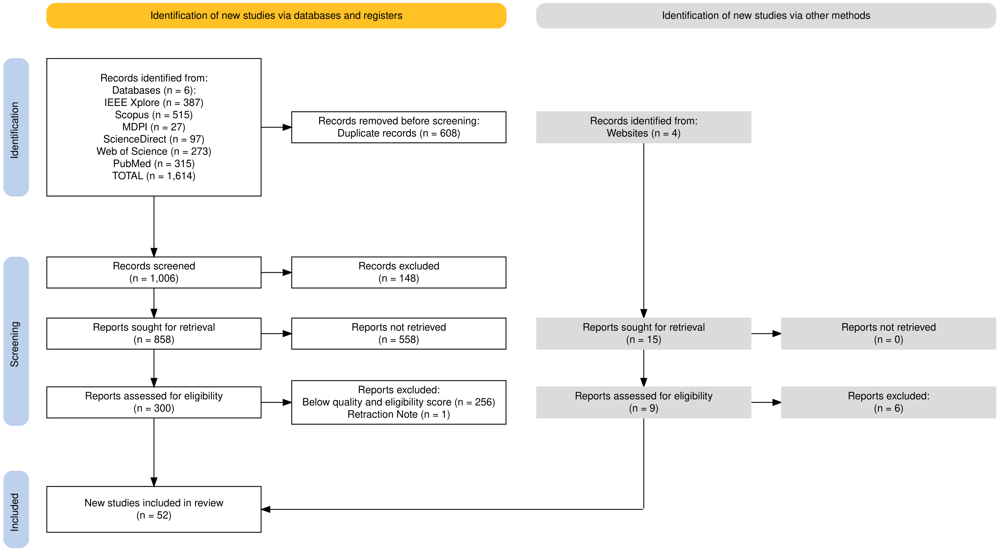
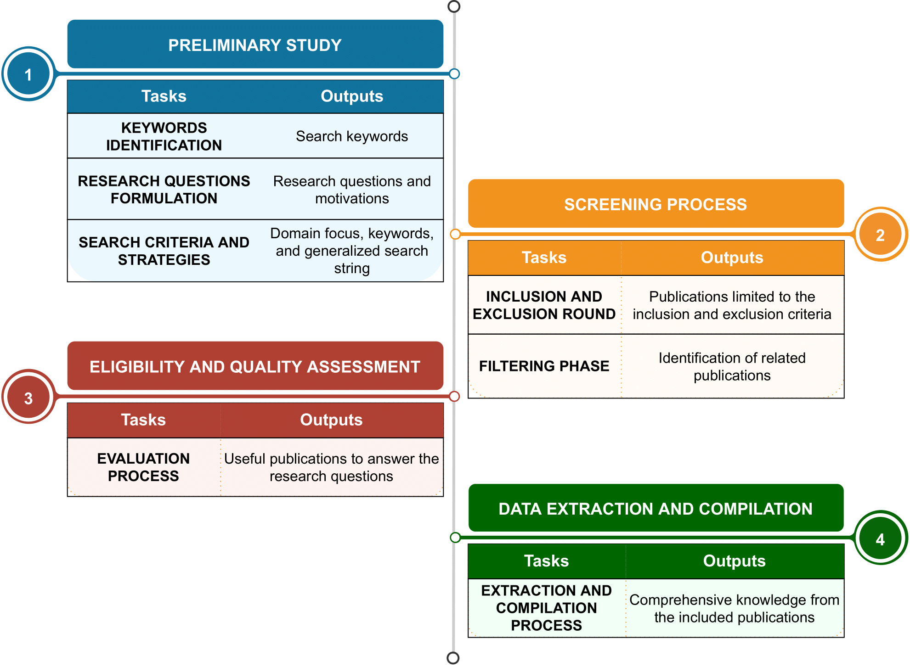

# Local Interpretable Model-Agnostic Explanation Approach for Medical Imaging Analysis: A Systematic Literature Review

## Preferred Reporting Items for Systematic reviews and Meta-Analyses (PRISMA)

    

## The literature review study mapping process

    

**Data Availability**
 
The Microsoft Excel file utilized for this systematic literature review will be made publicly accessible in this repository following the acceptance of our manuscript.

Thank you
